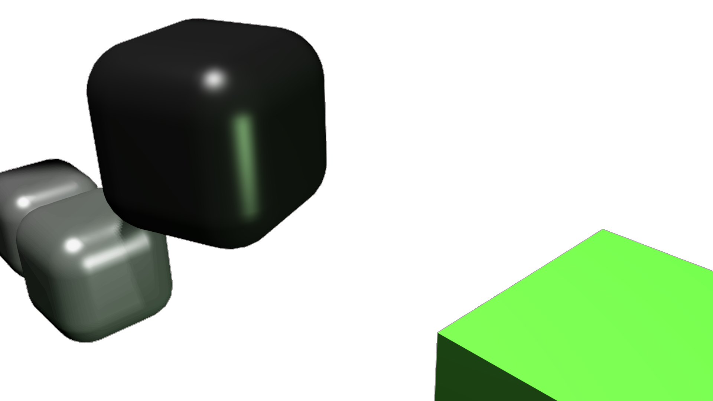

# Snake

Snake is a browser game where you control a hungry snake on a quest for food.

[Play the game](https://witiko.github.io/snake) and learn more about it through these detailed blog posts:

1. [My browser snake game from 15 years ago, now free and open-source](https://witiko.github.io/Snake/)
2. [Game loop and systems](https://witiko.github.io/Snake-2/)
3. [Interplay between different systems](https://witiko.github.io/Snake-3/)
4. [Design, influences, and technology](https://witiko.github.io/Snake-4/)
5. [Future work](https://witiko.github.io/Snake-5/)

 

``` yaml
SPDX-License-Identifier: GPL-2.0-or-later
```
